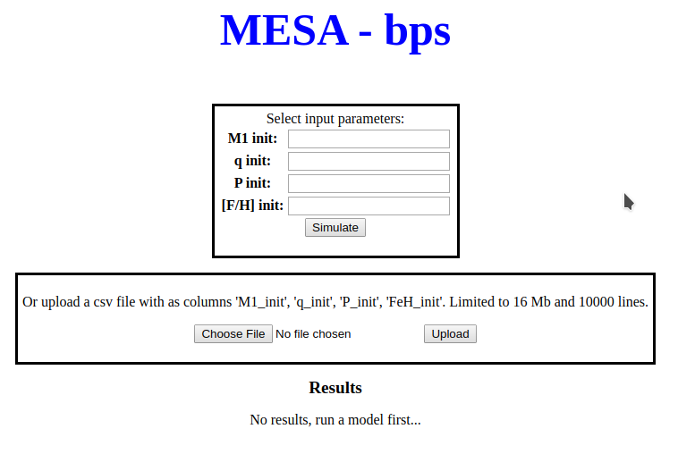

 
# MESA-bps

MESA-bps is a proof of concept to show that neural networks trained on full 1D stellar evolution models, 
as in this case MESA, can be used as a fast binary population synthesis code. MESA-bps is a Flask app 
running on Heroku that uses a NN created with the NNaPS package to perform BPS runs as an online service.

The model used in MESA-bps is a simple one that focuses on predicting the orbital properties during the 
He core burning phase of binary systems that interacted on the red giant branch. 

I have spend no time on the web interface of MESA-bps so it may feel a bit like a 90s webpage.

MESA-bps runs on heroku: https://mesa-bps.herokuapp.com/ It runs on a free dyno and sometimes needs some
time to load. The actual predictions after the page has loaded are very fast.

